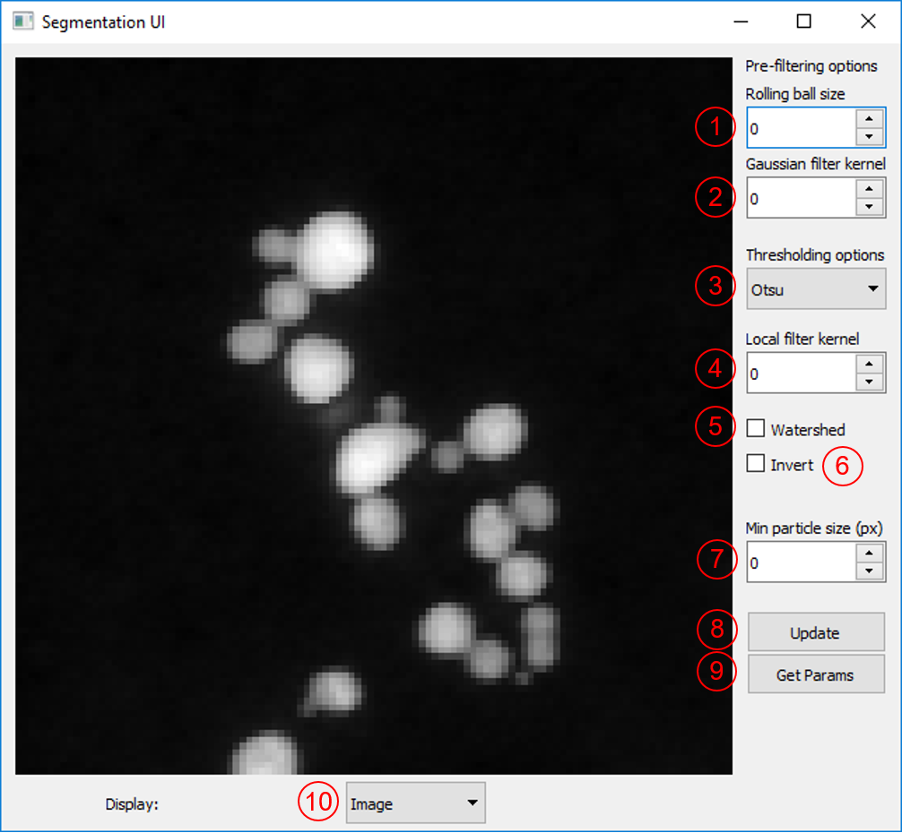
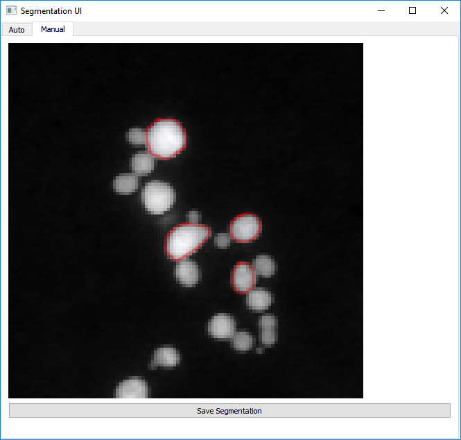
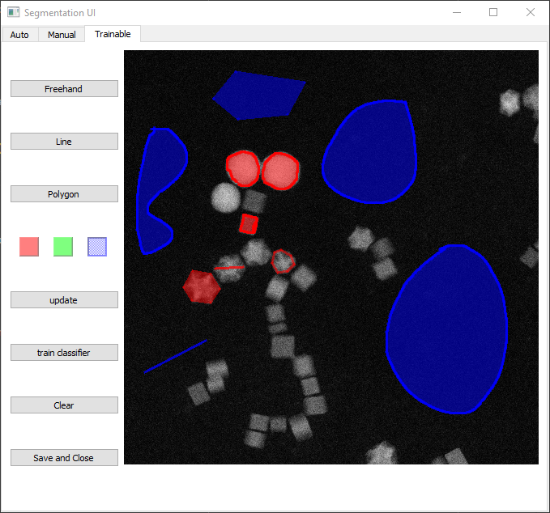

.. _segmentation:

************
Segmentation
************

ParticleSpy provides different options for the segmentation of particles from images.

Using a Pre-Segmented Mask
--------------------------

The most straightforward method is to supply ParticleSpy with a pre-segmented mask (boolean image).

.. code-block:: python

    >>> ParticleAnalysis(acquisition, parameters, mask = numpy array containg mask data)

In this way other software (e.g. ImageJ) could be used to perform segmentation which is then used by ParticleSpy to segment particles.

Using the Segmentation User Interface
-------------------------------------

ParticleSpy can also perform its own segmentation either using automated functions from scikit-image or using a fully manual approach.
In order to assist with both methods, ParticleSpy provides a Segmentation User Interface.
This can be launched from a python kernel using the :py:meth:`~.SegUI` function.

.. code-block:: python

    >>> SegUI(image)

Parameter Picking for Automated Segmentation
============================================

Once the Segmentation User Interface is launched the 'Auto' panel is displayed.
This panel provides a number of options that can be tuned to provide an optimal automated segmentation.
Once you have chosen your parameters, pressing 'Update' will display a segmented image.
'Update' will also save the current parameters to use later.

The parameters for the automated segmentation are described here:

(1) Rolling ball size
    
The rolling ball algorithm is equivalent to a top hat filter. It acts to remove slowly varying background intensity at a size larger than the particle diameter. The default is to not apply a rolling ball (value = 0). To apply a rolling ball enter a value (in pixels) that is significantly larger than your particle diameter.

(2) Gaussian filter kernel
    
This is an option to apply a Gaussian filter to the image before segmentation, to assisst with noisy data. Typically, a value of 1 - 3 works well.

(3) Thresholding options
    
Here are a series of algorithms for determining thresholds at which to segment. Most of the options available in scikit-image are included, including the popular Otsu, Isodata and Li methods. From Otsu to Li are all global methods and will set one threshold value for the whole image. Below Li are local methods that will set threshold values that change over the image. Local and local Otsu work slightly differently but will provide a segmentation in which variations in intensity across an image are taken in to account. Local + Global Otsu performs both local and global thresholding. Niblack and Sauvola are also local thresholding methods that account for deviations in the intensity across the image.

.. warning::
   Methods using the Local Otsu may take a long time on large images.

(4) Local filter kernel
    
Select the size of the local filter kernel to use if using one of the local thresholding methods. A value between 2 - 10 times smaller than the image may work.

(5) Watershed
    
Tick to apply a watershed step to the segmented labels. This acts to separate touching objects. The watershed algorithm uses local maxima of the distance transform as seeds, the minimum separation of these local maxima is set by the min particle size option.

(6) Watershed Seed Separation

Select the distance between the local maxima used to seed the watershed algorithm.

(7) Watershed Seed Erosion

Select the number of pixels by which to erode the thresholded image before using a distance transform to seed the watershed algorithm.

(6) Invert
    
Option to invert the image intensity when using a bright field image.

(7) Min particle size
    
This parameter has two uses. Firstly, it acts to remove any labels (objects) that have an area (in pixels) below this value. Secondly, it acts as the minimum separation for seeds in the watershed algorithm.

(8) Update
    
Updates the displayed image with the current parameters and updates the current parameters file.

(9) Get Params
    
Prints the current parameters as output for reference.

(10) Display
     
Option to display either the image with label boundaries displayed, or the solid labels coloured by label number.

Manual Segmentation
===================

The second tab in the Segmentation User Interface provides an option to manually segment an individual image.
You can get to this tab by clicking 'Manual' in the top bar.

Here, segmentation works by holding the left mouse button and drawing around the outside of a particle.
Once you have completely enclosed the particle, release the left mouse button.
If you are happy with your particle boundary, click on the particle centre with the right mouse button.
You may notice the middle of the particle turn slightly blue (can be difficult to see).
Continue to segment all of the particles in the image in this way until all are segmented.

Once you have segmented all of the particles, click 'Save Segmentation'.
This will save the generated segmentation as an internal npy file that can be read when using :py:meth:`~.ParticleAnalysis`.

.. warning::
   Do NOT right-click on any part of the image that is not fully enclosed by a red circle.
   Doing so will ruin the segmentation and you will have to reload SegUI.

Filter-Based Clustering and Segmentation
----------------------------------------

ParticleSpy can also segment images by clustering over different filter kernels.
This is done by calling:

.. code-block:: python

    >>> ClusterLearn(image, methods = name of clustering algorithm, desired feature sets, parameters)

This returns a segmentation mask of the image.
This can be carried out for a sequence of images using ``ClusterLearnSeries``.

In future versions, this will most likely be updated to be selected via a GUI or with a list of presets.

Trainable Segmentation
----------------------

Using the Segmentation User Interface, trainable segmentation can be performed using the 'Training' tab in the the top bar.

Labels can be drawn onto the image using the tools at the top-left :

* The freehand tool operates by pressing and holding the left mouse button to draw lines.
* The line tool operates by left clicking twice, which produces a line between them, which is automatically added to the set of labels.
* The polygon tool can be used to enclose a region by clicking to form the polygon and clicking on the start of the shape to finish one polygon.

As with manual segmentation, any enclosed region can be labelled by right clicking within it. 
This can be done in multiple colours, by selecting the desired colour before labelling a region.

Different filter kernels and classifiers can be chosen using the dropdowns and tick boxes. 
The filter kernel parameters can also be altered using the Sigma, High Sigma and Disk Size parameters.
Once areas have been labelled, training can be begun using the 'Update' and 'Train Classifier' Button.

When this finishes the labels will be shown on top of the image in the user interface, this can take up to several minutes.
The classifier can then be retrained with additional pixels by by clearing the canvas of the displayed segmentation with `Clear Canvas`, and redrawing previous training labels with `redraw training labels`.
the `clear training labels` can be used to delete the existing labels in memory, visible or not.

Using the classifier generated, multiple images can be segmented. An example is shown in the following code:

.. code-block:: python

    folder = 'folder path of images to segment'
    first = hs.load(f'{folder}/first image in folder')

    out = ps.SegUI(first)
    clf = out.classifier

    params = ps.parameters()
    params.generate()
    particles = None

    for image in os.listdir(folder):
        imagefile = hs.load(os.path.join(folder,image))
        l = imagefile.data
        mask_im = ps.ClassifierSegment(clf, l)
        
        particles = ps.ParticleAnalysis(imagefile, params,particles=particles, mask=mask_im)

Trainable Segmentation can also be performed using an existing segmentation mask to train the classifier before further classification.
This is shown in the example below:

.. code-block:: python

    from PIL import Image
    import numpy as np
    from sklearn.naive_bayes import GaussianNB
    import ParticleSpy.api as ps

    image = hs.load("image path")
    mask = np.asarray(Image.open("mask path"))
    mask = ps.toggle_channels(mask[:,:,:3], colors = ['#000000','#ffffff'])
    clf = GaussianNB()

    _, clf = ps.ClusterTrained(image, mask, clf)

This classifier can then be used to segment images.
The function ``ps.toggle_channels`` is used to convert an RGB image into a 2D indexed array of labels. 
This can also be used to convert the output of the ``ClassifierSegment`` into RGB images which can be exported.
